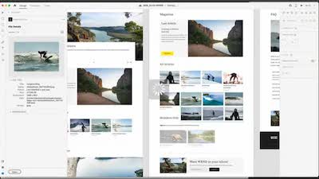
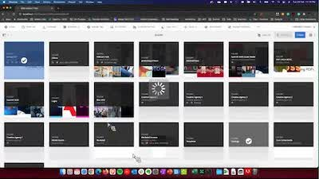
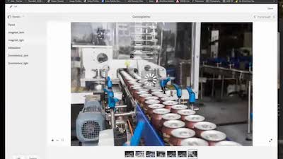

# [!DNL Experience Manager] スキルビルダーの録画

Adobe [!DNL Experience Manager] スキルビルダーの録画ホームへようこそ。ここでは、ナレッジ ベースを構築し、Adobe [!DNL Experience Manager] への投資を最大限に活用するように設計された録画ウェビナーをご覧いただけます。

## 新機能

<table>
<tr>
  <td>
    
    

      <a href="https://experienceleague.adobe.com/ja/docs/experience-manager-skill-builder/skill-builder/for-2020/asset-link">
    <strong>[!DNL Asset Link]</strong>
    </a>
    

    

    <em>[!DNL Asset Link] は、Adobe Creative Cloud へのネイティブな接続です。</em>
    

  </td>
  <td>
    
    

    <a href="https://experienceleague.adobe.com/ja/docs/experience-manager-skill-builder/skill-builder/for-2020/brand-portal">
    <strong>Brand Portal</strong>
    </a>
    

    

    <em>社内外チームとのアセット共有が容易になりました。</em>
    

  </td>
  <td>
    
     

      <a href="https://experienceleague.adobe.com/ja/docs/experience-manager-skill-builder/skill-builder/for-2020/dynamic-media">
        <strong>[!DNL Dynamic Media]</strong>
      </a>
    

    

    <em>すべてのチャネルと画面のアセット出力を自動化します。</em>
    

  </td>
</tr>
</table>

>[!TIP]
>
>**以前のスキルビルダーイベントの録画については、左側のナビゲーションを参照してください**。
