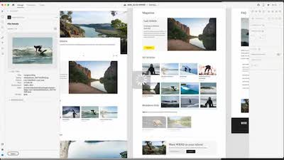

# [!DNL Experience Manager] スキルビルダーの記録

ようこそAdobe [!DNL Experience Manager] スキルビルダーレコーディングホーム。 これらは、ナレッジベースを構築し、Adobeへの投資を最大限に活用するためのウェビナーとして記録されています。 [!DNL Experience Manager].

## 新機能

<table>
<tr>
  <td>
    
    

      <a href="https://experienceleague.adobe.com/docs/experience-manager-skill-builder/skill-builder/2020/asset-link.html">
    <strong>[!DNL Asset Link]</strong>
    </a>
    

    

    <em>[!DNL Asset Link] は、Adobe Creative Cloudとのネイティブな接続です。</em>
    

  </td>
  <td>
    
    

    <a href="https://experienceleague.adobe.com/docs/experience-manager-skill-builder/skill-builder/2020/brand-portal.html">
    <strong>Brand Portal</strong>
    </a>
    

    

    <em>内部チームや外部チームとのアセット共有が容易になりました。</em>
    

  </td>
  <td>
    
     

      <a href="https://experienceleague.adobe.com/docs/experience-manager-skill-builder/skill-builder/2020/dynamic-media.html">
        <strong>[!DNL Dynamic Media]</strong>
      </a>
    

    

    <em>すべてのチャネルと画面のアセット出力を自動化します。</em>
    

  </td>
</tr>
</table>

>[!TIP]
>
>**以前の Skill Builder イベントの記録については、左側のナビゲーションを参照してください**.
